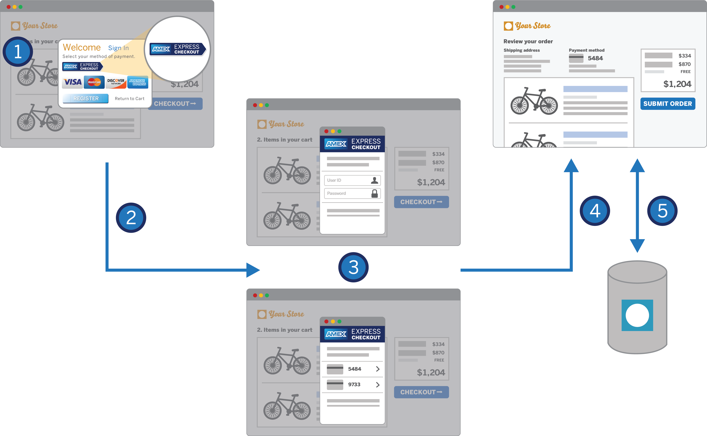

# Express Checkout Tutorials

The following should be used as sample pieces of code in which to create the [Express Checkout](https://developer.americanexpress.com/products/express-checkout/overview) flow.

## Disclaimer 
Before implementing Amex Express Checkout in your app, you must agree and adhere to the Amex for Developers [Terms of Use](https://developer.americanexpress.com/terms) and the American Express Checkout [Button Implementation Guidelines](https://developer.americanexpress.com/products/express-checkout/guide#marks). Furthermore, all access to and use of the Amex for Developers Portal is subject to the [Online Privacy Agreement](https://developer.americanexpress.com/online-privacy).
Please review these documents prior to the use of these tutorials and/or sample code. 

## Table of contents:

 * Introduction to the Developer Portal
 * Amex Express Checkout Examples & Tutorials
	 * [Using the Java SDK](./java-sdk/README.md)
		 * Prerequisites
		 * Client-Side
		 * Server-Side
	 * [Using the Stripe API](./stripe-api/README.md)
		 * Prerequisites
		 * Displaying the button
		 * Connecting a back-end service

## Introduction to the Developer Portal

American Express powers billions of transactions worldwide. To make its software more accessible, Amex released the [Developer Portal](https://developer.americanexpress.com/home) in October 2016. As of this article, 12 APIs are featured on the portal in the following categories:

* Fraud Prevention
* Payment Services
* Personalization Services
* Utilities

The Developer Portal is publically available and free to access.

## Express Checkout

In these articles, we have focused solely on Amex Express Checkout. Express Checkout offers the ability to securely and easily checkout on a merchant website, by using an American Express login to autofill Card details and Account information. You can find the official documentation on the [documentation tab](https://developer.americanexpress.com/documentation) as well as the [products tab](https://developer.americanexpress.com/products) of the Developer Portal.

## Contributing

We welcome Your interest in the American Express Open Source Community on Github. Any Contributor to any Open Source
Project managed by the American Express Open Source Community must accept and sign an Agreement indicating agreement to
the terms below. Except for the rights granted in this Agreement to American Express and to recipients of software
distributed by American Express, You reserve all right, title, and interest, if any, in and to Your Contributions.
Please [fill out the Agreement](https://cla-assistant.io/americanexpress/express-checkout-tutorials).

Please feel free to open pull requests and see `CONTRIBUTING.md` for commit formatting details.

## License

Any contributions made under this project will be governed by the [Apache License 2.0](LICENSE.txt).

## Code of Conduct

This project adheres to the [American Express Community Guidelines](CODE_OF_CONDUCT.md). By participating, you are
expected to honor these guidelines.
